# 租房数据分析

---

2020211376 马天成


 

# 0. 实验概述


## 0.1 题目要求

1. 抓取链家官网北上广深 4 个一线城市，再加上一个离你家乡最近的一个非一 线城市/或者你最感兴趣的一个城市的数据。应获取每个城市的全部租房数 据（一线城市的数据量应该在万的数量级）。
2. 比较 5 个城市的总体房租情况，包含租金的均价、最高价、最低价、中位数等信息，单位面积租金（元/平米）的均价、最高价、最低价、中位数等信息。 采用合适的图或表形式进行展示。
3. 比较 5 个城市一居、二居、三居的情况，包含均价、最高价、最低价、中位数等信息。
4. 计算和分析每个城市不同板块的均价情况，并采用合适的图或表形式进行展 示。 例如上图中的“海淀-四季青-五福玲珑居北区”，“四季青”即为板块名称。
5. 比较各个城市不同朝向的单位面积租金分布情况，采用合适的图或表形式进 行展示。哪个方向最高，哪个方向最低？各个城市是否一致？如果不一致， 你认为原因是什么？
6. 查询各个城市的人均 GDP，分析并展示其和单位面积租金分布的关系。相对 而言，在哪个城市租房的性价比最高？
7. 查询各个城市的平均工资，分析并展示其和单位面积租金分布的关系。相对 而言，在哪个城市租房的负担最重？
8. 围绕各城市租房问题，结合上述数据及分析，设计自己感兴趣的数据分析主 题，补充查找或爬取相关数据，完成题目设计、数据获取、数据分析及数据 展示过程。 


## 0.2 报告要求

1. 实验报告中应包含爬虫核心代码、核心数据文件的基本结构、数据处理及数 据展示的核心代码。代码及文件中应包含足够的注释。
2. 报告应按照一般实验报告要求，至少包含明确的实验目的、过程、结论。
3. 报告以 pdf 格式提交，总页数不超过 30 页。
4. 报告具体提交方式由助教提供。
5. 报告提交截止时间：2022 年 12 月 31 日 24 点。


## 0.3 说明

1. 我选择 **合肥** 作为我的第五个城市。
2. 我收集了 **人均可支配收入**、**城市租房人数比率**、**城市非户籍常住人口比率 **来进行拓展分析
3. 由于报告30页限制，我将项目说明录制视频的连接放在这里，希望有所帮助：[My Video](https://www.bilibili.com/video/BV1JM411y7NH/)
4. 我的 Github 仓库[My Repositories (github.com)](https://github.com/Cowboy-Spike-Spiegel?tab=repositories)


# 1. 项目概述

下面是项目结构：

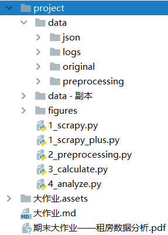

​	下面我将简单介绍一下各个文件：


## 1.1 Python代码部分（4个步骤）

​	这里有共有四个Python文件；这些文件的大致功能如下：

1. 数据爬取模块：输入爬取的 html，输出 csv 文件；plus 版是在分析完之后发现 **根据板块获取数据更好** 而做的改进版。
2. 数据预处理模块：输入 csv，输出 csv；将原先的 csv 文件进行 **去重** 和 **计算拓展成列**，生成新的有效 csv 文件，可供分析。
3. 数据计算模块：输入有效的 csv，输出 json；将 csv 的数据进行分析统计，算出**分析阶段需要并且可计算的所有数据**存入 json。
4. 分析模块：输入 json文件 和 查询数据；进行分析展示，存储图像并展示。

​	**ATTENTION**：所有的 Python 代码我都是经过：

1. 精心设计，反复修改；
2. 结构工整，思路清晰，无冗余代码；
3. 变量规范，常量定义完整；
4. 绝对不是 **shit mountain**！


## 1.2 data 文件夹（存储中间数据文件）


### 1.2.1 original 文件夹

​	存储了 **1_scrapy_plus.py** 中从网站爬下来的有效数据，根据城市区分，存储为 csv文件。


### 1.2.2 preprocessing & logs 文件夹

1. 在 **2_preprocessing.py** 进行预处理，中将上一个 original 文件夹中的数据进行 **去重**、**数据计算拓展**，生成可以直接进行第三部统计的 csv 文件。这个 csv 文件就存储在 **preprocessing 文件夹** 中。
2. 此外，在生成预处理数据数据时，我们会进行 **去重** 和 **删除非法记录**，在这个过程中，我们将：
  1. **记录及其重复次数 & 处理结果** 录入 **城市.log** 中
  2. **记录重复的详细信息** 录入 **城市_repeat.txt** 中
  3. **非法而删除的记录**录入 **城市_error.txt** 中
3. 在介绍预处理代码 -  **2_preprocessing.py**  时我们会详细介绍这三个文件的格式和内容。


### 1.2.3 json 文件夹

1. 在 **3_calculate.py** 进行计算，中将上一个 preprocessing 文件夹中的数据进行 **计算**，生成城市的 json 文件，存储在 **json 文件夹** 。

2. 这些 json 文件计算了所有在分析阶段需要的数据。该计算已经将所有需要并可以计算的数据都计算出（一些在分析阶段引入的新数据需要重新计算），以字典形式存放为 json；此后就 **不再需要csv文件**， 只需要用 **json** 文件进行分析，大大减少数据量。


## 1.3 figure 文件夹

可算作分析结果。

存储了  **4_analyze.py** 的输出图像。


## 1.4 data - 副本 文件夹

​	存储了老版数据爬取方式（在城市主页用综合排序页面爬取）的数据。这个数据是比用城区爬取的数据差很多的。


# 2. 实验内容


## 2.1 数据爬取模块

**1_scrapy_plus.py**

```python
from urllib.request import urlopen
from bs4 import BeautifulSoup
import csv

# target cities
cities = {'北京': 'bj', '上海': 'sh', '广州': 'gz', '深圳': 'sz', '合肥': 'hf'}

# csv outputFile attributes
csv_attributes = ['title', 'name', 'area', 'rooms', 'price_lower', 'price_upper']


# ***
records_in_a_page = 30

# get cities rent data
for name, info in cities.items():
    # root url path
    url_root = 'https://' + info + '.lianjia.com'

    # generate name.csv -------------------------------------------------------
    with open('data/original/'+name+".csv", 'w', newline='', encoding='utf-8-sig') as outputFile:
        writer = csv.writer(outputFile)
        writer.writerow(csv_attributes)

        # 1, get districts path in this city ----------------------------------
        html = BeautifulSoup(urlopen(url_root + '/zufang'), features="lxml")
        # find all district blocks
        blocks = html.findAll(name='li', attrs={'class': 'filter__item--level2', 'data-type': 'district'})
        # get all district path (ignore the first district-'不限')
        district_path_list = list()
        for i in range(1, len(blocks)):
            district_path_list.append(blocks[i].find('a')['href'])

        # 2. get data each from each district pages ---------------------------
        for path in district_path_list:
            # 2.1 get page size for this city from city's index page
            html = BeautifulSoup(urlopen(url_root + path), features="lxml")
            size_record = int(html.findAll(name="span", attrs={"class": "content__title--hl"})[0].text)
            size_page = int(size_record / records_in_a_page)
            if( size_record % records_in_a_page > 0 ):
                size_page = size_page+1
            print(path, size_record, size_page)

            # 2.2 scrapy data in pages & copy data into file
            for i in range(1, size_page+1):
                print(i)
                html = BeautifulSoup(urlopen(url_root + path + 'pg' + str(i)), features="lxml")

                # get data into list
                title_block = html.findAll("p", {"class": "content__list--item--title"})
                des_block = html.findAll("p", {"class": "content__list--item--des"})
                price_block = html.findAll("span", {"class": "content__list--item-price"})
                for title, des, price in zip(title_block, des_block, price_block):
                    # solve title
                    title = title.get_text().strip()
                    # solve des
                    des_list = des.get_text().split('/')
                    if len(des_list) == 5:
                        name = des_list[0].replace("\n","").strip()
                        area = des_list[1].replace("\n","").strip()[:-1]
                        rooms = des_list[3].replace("\n", "").strip()[0]
                    elif len(des_list) == 3:
                        name = ""
                        area = des_list[0].replace("\n", "").strip()[:-1]
                        rooms = des_list[2].replace("\n", "").strip()[0]
                    # solve price
                    text = price.get_text().split(' ')[0]
                    if '-' in text:
                        text = text.split('-')
                        price_lower = text[0]
                        price_upper = text[1]
                    else:
                        price_lower = text
                        price_upper = text
                    writer.writerows([[title, name, area, rooms, price_lower, price_upper]])
```

​	这里不提供原版的代码了，在附录中会提供。


### 2.1.1 代码过程分析

1. 在开头给出五个城市的的 **命名和简写对照 dict**，方便自动遍历和爬取，用循环减少无谓的相似代码。
2. 再给出 csv 文件需要爬取的各个属性（属性行），以及一个页面的租房记录数：30。
3. 打开需要生成的文件：**data/original/城市名.csv**，并写入csv 的 属性行 csv_attributes
4. **循环**每个城市：
	1. 获取当前页面的 **地区标签相对 path**（藏于 href），存入 **district_list**。
	2. 根据 **district_list** 的元素到达每个子页面。获得当前的页面的租房数据数量，计算出该 district 遍历完所需的页面数：**记录数 / 单个页面记录数**（开头已给出定义）。然后**循环**进入每个该地区的顺序页面：
		1. 获取当前城市的html文件；
		2. 根据当前 html体，获取30个记录需要录入的数据，存为 list。循环该 list：
			1. 分析数据，将记录数据拆开，化成 attribute 的形式，一个个**写入 csv** 中。


### 2.1.2 数据转化细节分析

​	只需要在处理时取出相应数据，然后取出即可。下面有几个数据爬取策略

1. 几室：取出字段出去前导换行空格后的第一个字符。
2. 面积：删除前导后导空格换行，并删除最后一个字符。


## 2.2 数据预处理模块

**2_preprocessing.py**

```python
import pandas as pd
import csv

# target cities
cities = {'北京': 'bj', '上海': 'sh', '广州': 'gz', '深圳': 'sz', '合肥': 'hf'}

# csv outputFile attributes
csv_attributes = ['title', 'name', 'area', 'rooms',
                  'price_lower', 'price_upper', 'price_average',
                  'price_square_lower', 'price_square_upper', 'price_square_average']


# preprocessing each city.csv with "deduplicate" and "append"
for name, info in cities.items():

    # read data & convert into list -------------------------------------------
    data = pd.read_csv('data/original/'+name+'.csv', encoding='utf-8-sig')
    data = data.values.tolist()
    original_size = len(data)
    print('preprocessing', name, original_size)

    # open log and error file
    logFile = open('data/logs/' + name + ".log", 'w', encoding='utf-8')
    repeatFile = open('data/logs/' + name + "_repeat.txt", 'w', encoding='utf-8')
    errorFile = open('data/logs/' + name + "_error.txt", 'w', encoding='utf-8')

    # generate deduplicated data & write into file ----------------------------
    with open('data/preprocessing/' + name + ".csv", 'w', newline='', encoding='utf-8-sig') as outputFile:
        writer = csv.writer(outputFile)
        writer.writerow(csv_attributes)

        # generate price_square_lower, price_square_upper & deduplicate
        i = 0
        cnt_delete = 0
        while i < len(data):
            # solve illegal records depend on rooms
            if str(data[i][3]).isdigit()==False or int(data[i][3])<=0:
                # write into error.log
                errorFile.write(str(data[i])+'\n')
                del data[i]
                cnt_delete += 1
                continue

            # deduplicate
            #print('deduplicate', i)
            cnt_repeat = 0
            j = i+1
            while j < len(data):
                # find repeat
                if data[i] == data[j]:
                    # write into repeat.log
                    repeatFile.write('['+str(i)+', '+str(j)+'] '+str(data[j])+'\n')
                    del data[j]
                    j -= 1
                    cnt_repeat += 1
                    cnt_delete += 1
                j += 1
            # for data[i], repeat cnt times
            if cnt_repeat > 0:
                logFile.write('repeat '+str(cnt_repeat)+' : '+str(data[i])+'\n')

            # append price_average, price_square_lower, price_square_upper, price_square_average
            if '-' in str(data[i][2]):
                area = str(data[i][2]).split('-')
                area = (float(area[0]) + float(area[1])) / 2
            else:
                area = float(data[i][2])
            data[i].append((float(data[i][4]) + float(data[i][5])) / 2)
            data[i].append(float(data[i][4]) / area)
            data[i].append(float(data[i][5]) / area)
            data[i].append((float(data[i][7]) + float(data[i][8])) / 2)
            # has deduplicated this record with writing into csv
            writer.writerow(data[i])

            i += 1

        # write delete counts
        summary = 'delete(repeat&illegal) : '+str(cnt_delete)+' | orignal '+str(original_size)+' remain '+str(len(data))
        logFile.write(summary)
        print(name, summary)

    # close log and error
    logFile.close()
    errorFile.close()
```


### 2.2.1 代码过程分析

1. 在开头给出五个城市的的 **命名和简写对照 dict**，方便自动遍历和爬取，用循环减少无谓的相似代码。
2. 再给出扩展后的 csv 文件需要爬取的各个属性（属性行）
3. 打开需要生成的文件：**data/preprocessing/城市名.csv**，并写入csv 的 属性行 csv_attributes
4. **循环**每个城市：
	1. 读取出这个城市的 original csv 文件并读出。
	2. 循环每一条记录：
		1. 当前记录不合法：**几室 - 录入了“未”字 || 数据为0**。删除该数据，放入 **error.txt ** 中，continue。
		2. **计算该条数据需要拓展的列数据（属性）**
		3. 从下一条记录开始找到最后，**循环**到最后一条：
			1. 假如记录和循环外的重复，则记录为重复，放入 **repeat.txt** 中。
		4. 假如当前的记录找到了重复，则把该条记录和重复次数放入 **城市名.log** 中。
	3. 将原记录数，删除记录数，剩余记录数最后再放入 **城市名.log** 中。
	4. 将删除后的数据写入新的 csv 文件：**data/preprocessing/城市名.csv**


### 2.2.2 输出文件格式样式

​	城市.log

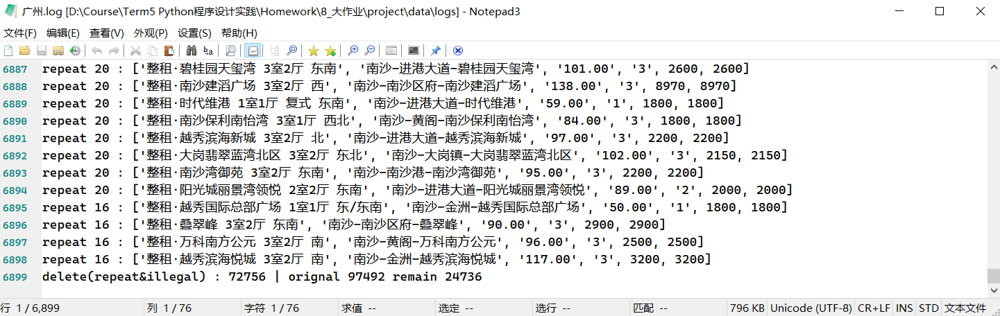

​	repeat.txt

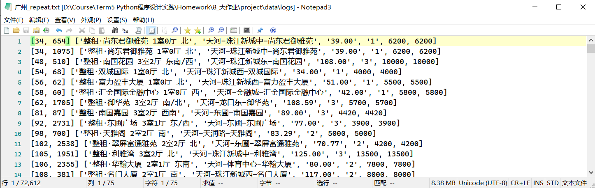

​	error.txt

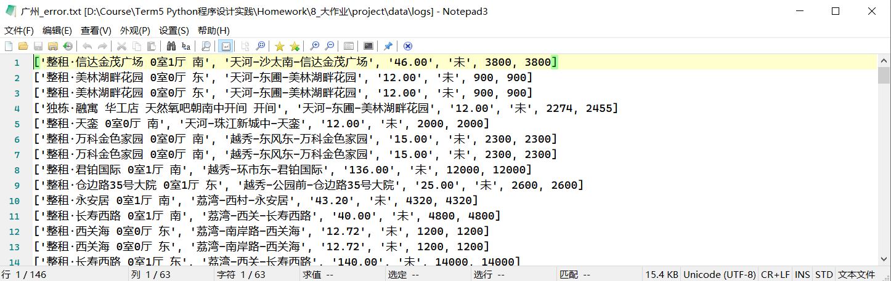


## 2.3 数据计算模块

**3_calculate.py**

```python
import pandas as pd
import json

# target cities
cities = {'北京': 'bj', '上海': 'sh', '广州': 'gz', '深圳': 'sz', '合肥': 'hf'}

# csv outputFile attributes
csv_attributes = ['title', 'name', 'area', 'rooms',
                  'price_lower', 'price_upper', 'price_average',
                  'price_square_lower', 'price_square_upper', 'price_square_average']


# calculate each city.json
for name, info in cities.items():

    # read data & convert into list -------------------------------------------
    data = pd.read_csv('data/preprocessing/'+name+'.csv')
    data = data.values.tolist()
    # preprocessing json list
    city_dict = dict()

    # generate city_json[0][1][2] (size & price & price_square) ---------------
    # variables
    price_total = 0
    price_lower = 0x3F3F3F
    price_upper = 0
    price_square_total = 0
    price_square_lower = 0x3F3F3F
    price_square_upper = 0

    # judge for each record
    for record in data:
        # update price-total, lower, upper
        price_total = price_total + float(record[6])
        price_lower = min(float(record[4]), price_lower)
        price_upper = max(float(record[5]), price_upper)
        # update price_square-total, lower, upper
        price_square_total = price_square_total + float(record[9])
        price_square_lower = min(float(record[7]), price_square_lower)
        price_square_upper = max(float(record[8]), price_square_upper)

    # calculate average and middle
    price_average = price_total / len(data)
    sorted(data, key=(lambda x: x[6]))  # sort by price_average
    index = int(len(data)/2)
    if len(data) & 1 == 1:
        price_middle = float(data[index][6])
    else:
        price_middle = (float(data[index][6]) + float(data[index+1][6])) / 2

    # calculate price_square average and middle for room_i
    price_square_average = price_square_total / len(data)
    sorted(data, key=(lambda x: x[9]))  # sort by price_square_average
    index = int(len(data)/2)
    if len(data) & 1 == 1:
        price_square_middle = float(data[index][9])
    else:
        price_square_middle = (float(data[index][9]) + float(data[index+1][9])) / 2

    # store calculate data into json
    city_dict['size'] = len(data)
    city_dict['price'] = {'average': price_average,
                          'lower': price_lower,
                          'upper': price_upper,
                          'middle': price_middle}
    city_dict['price_square'] = {'average': price_square_average,
                          'lower': price_square_lower,
                          'upper': price_square_upper,
                          'middle': price_square_middle}

    # generate city_json[3:5] (room1:3 calculate) -----------------------------
    # variables (list for room_1, room_2, room_3)
    rooms = [list(), list(), list()]
    price_total = [0, 0, 0]
    price_lower = [0x3F3F3F, 0x3F3F3F, 0x3F3F3F]
    price_upper = [0, 0, 0]
    # judge for each record
    for record in data:
        if record[3] <= 3:
            index = record[3]-1
            # store this record
            rooms[index].append(record)
            # update price-total, lower, upper
            price_total[index] = price_total[index] + float(record[6])
            price_lower[index] = min(float(record[4]), price_lower[index])
            price_upper[index] = max(float(record[5]), price_upper[index])

    # variables
    price_average = [0, 0, 0]
    price_middle = [0, 0, 0]
    for i in range(3):
        # calculate average and middle
        price_average[i] = price_total[i]/len(rooms[i])
        sorted(rooms[i], key=(lambda x: x[6]))  # sort by price_average
        index = int(len(rooms[i])/2)
        if len(rooms[i])&1 == 1:
            price_middle[i] = float(rooms[i][index][6])
        else:
            price_middle[i] = float(float(rooms[i][index][6])+float(rooms[i][index+1][6]))/2

        # store calculate data into city.json
        key = 'room_'+str(i+1)
        city_dict[key] = {'size': len(rooms[i]),
                          'average': price_average[i],
                          'lower': price_lower[i],
                          'upper': price_upper[i],
                          'middle': price_middle[i]}

    # generate city_json[6:9] (north & south & west & east) -------------------
    size = [0, 0, 0, 0]
    price_square_total = [0, 0, 0, 0]
    for record in data:
        if '北' in record[0]:
            size[0] += 1
            price_square_total[0] += float(record[9])
        if '南' in record[0]:
            size[1] += 1
            price_square_total[1] += float(record[9])
        if '西' in record[0]:
            size[2] += 1
            price_square_total[2] += float(record[9])
        if '东' in record[0]:
            size[3] += 1
            price_square_total[3] += float(record[9])

    # store calculate data into city.json
    city_dict['North'] = {'size': size[0], 'price_square_average': price_square_total[0] / size[0]}
    city_dict['South'] = {'size': size[1], 'price_square_average': price_square_total[1] / size[1]}
    city_dict['West'] = {'size': size[2], 'price_square_average': price_square_total[2] / size[2]}
    city_dict['East'] = {'size': size[3], 'price_square_average': price_square_total[3] / size[3]}

    # generate city_json[10] (plate) ------------------------------------------
    # store plates' name
    plate_set = set()
    for record in data:
        # cause some records has no plate!!!
        if type(record[1]) == str and record[1] != 'nan':
            plate_set.add(record[1].split('-')[1])

    # generate each plates' price_average
    plate_list = list(plate_set)
    plate_size = [0] * len(plate_list)
    plate_total = [0] * len(plate_list)
    for record in data:
        if type(record[1]) == str and record[1] != 'nan':
            index = plate_list.index(record[1].split('-')[1])
            plate_size[index] += 1
            plate_total[index] += record[6]
    plate_dict = dict()
    for i in range(len(plate_list)):
        plate_dict[plate_list[i]] = {'size': plate_size[i], 'average': plate_total[i] / plate_size[i]}

    # store calculate data into city.json
    city_dict['plates'] = {'size': len(plate_list), 'data': plate_dict}

    # write city.json ---------------------------------------------------------
    with open('data/json/' + name + ".json", 'w') as jsonFile:
        jsonFile.write(json.dumps(city_dict, indent=1, ensure_ascii=False))
```


### 2.3.1 代码过程分析

1. 在开头给出五个城市的的 **命名和简写对照 dict**，方便自动遍历和爬取，用循环减少无谓的相似代码。
2. 循环每个城市：
	1. 读入文件：**data/preprocessing/城市名.csv**
	2. 计算 **租房价格** 的：平均值，最小值，最大值，中位数。
	3. 计算 **单位面积租房价格** 的：平均值，最小值，最大值，中位数。
	4. 计算一室二室三室的 **租房价格** 的：平均值，最小值，最大值，中位数。
	5. 计算东南西北 **单位面积租房价格** 的：平均值，最小值，最大值，中位数。
	6. 计算出板块集合，循环每一个板块：
	  1. 找到所有的板块，记录相应数据。
	7. 算出各个板块的 **平均单位面积租房价格**。
	8. 将上述数据存入 **data/json/城市.json** 中。


### 2.3.1 json 文件样例

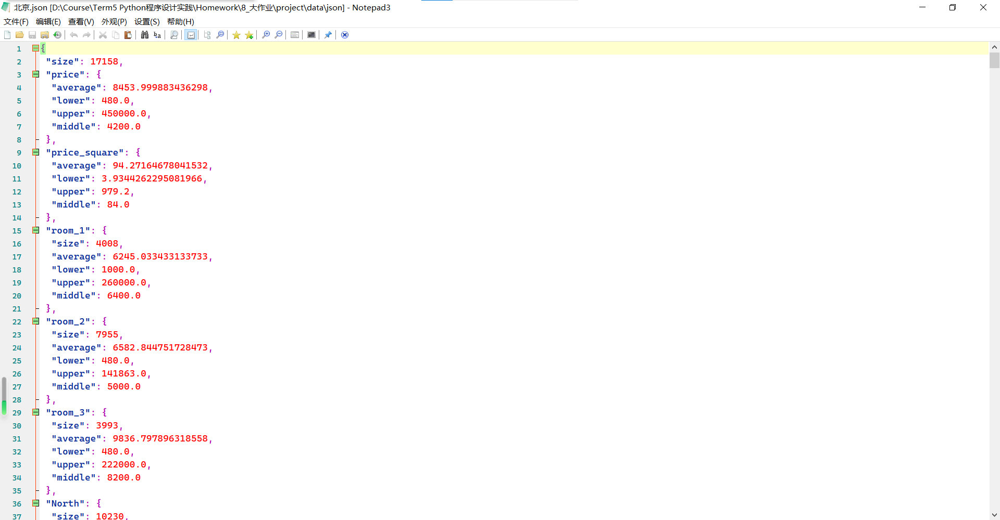

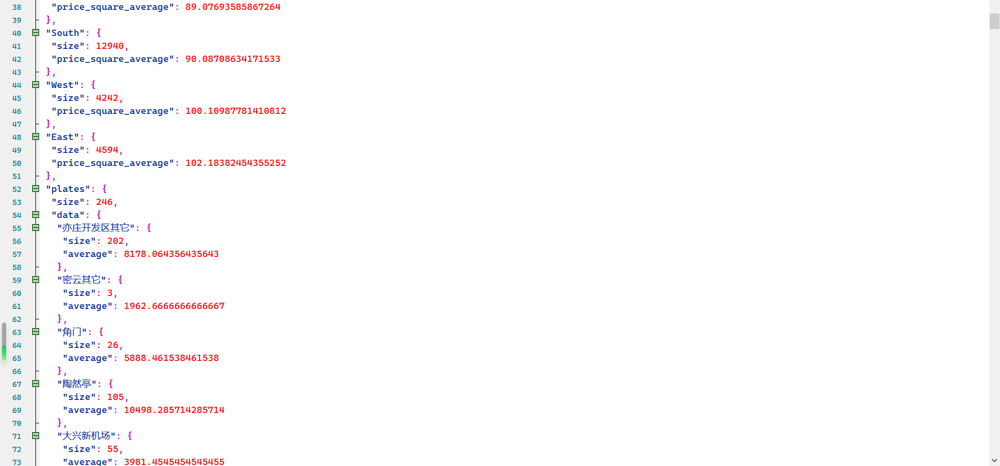


## 2.4 分析模块

**4_analyze.py**

```python
import matplotlib.pyplot as plt
import json


# target cities
cities = {'北京': 'bj', '上海': 'sh', '广州': 'gz', '深圳': 'sz', '合肥': 'hf'}
city_name = ['北京', '上海', '广州', '深圳', '合肥']

# path
path_json = 'data/json/'
path_figure = 'figures/'
# figure count for saving
cnt_figure = 1


# read city.json data ---------------------------------------------------------
data_dict = dict()
for name in city_name:
    with open(path_json + name + '.json', 'r') as f:
        data_dict[name] = json.load(f)


# analyze preparations --------------------------------------------------------

# set each data size
city_size = 5
price_size = 4
room_size = 3
direction_size = 4

# set keys to find in data_dict
price_keys = ['average', 'lower', 'upper', 'middle']
room_keys = ['room_1', 'room_2', 'room_3']
direction_keys = ['North', 'South', 'West', 'East']

# set limits (has manually selected from json)
price_limit = 400000
price_square_limit = 3000

# set color list
color_city = ['orange', 'deepskyblue', 'orchid', 'g', 'y']
color_room = ['orange', 'deepskyblue', 'orchid', 'g']
color_direction = ['orange', 'deepskyblue', 'orchid', 'g']

# set pie label
pie_room = ['room_1', 'room_2', 'room_3', 'room_>=4']   # add last two show

# set font
plt.rcParams['font.sans-serif'] = ['SimHei']


# Task 1: compare 5 cities ----------------------------------------------------

# 1.1: compare 5 cities with price

plt.figure(figsize=(40, 20))
# find each price category with i (generate 4 sub figures)
for i in range(price_size):
    # basic settings
    plt.subplot(1, price_size, i + 1)
    plt.title('Price-'+price_keys[i], fontsize=30)
    plt.xlabel('cities', fontsize=15)
    plt.ylabel('price(￥/m^2)', fontsize=15)

    # generate x & y data
    x = [i for i in range(1, city_size+1)]
    y = list()
    for name in city_name:
        y.append(data_dict[name]['price'][price_keys[i]])

    # generate subplot
    plt.ylim((0, price_limit))
    plt.bar(x, y, color=color_city)
    # add text
    plt.xticks(x, city_name, size=30)
    for x_value, y_value in zip(x, y):
        plt.text(x_value, y_value, '%.4f' % y_value, ha='center', fontsize=15)

# print & save plot
plt.suptitle('Price Compare',fontsize=30)
plt.savefig(path_figure + str(cnt_figure))
cnt_figure += 1
plt.show()


# 1.2: compare 5 cities with price_average

plt.figure(figsize=(40, 20))
# find each price category with i (generate 4 sub figures)
for i in range(price_size):
    # basic settings
    plt.subplot(1, price_size, i + 1)
    plt.title('Price_square-'+price_keys[i], fontsize=30)
    plt.xlabel('cities', fontsize=15)
    plt.ylabel('price(￥/m^2)', fontsize=15)

    # generate x & y data
    x = [i for i in range(1, city_size+1)]
    y = list()
    for name in city_name:
        y.append(data_dict[name]['price_square'][price_keys[i]])

    # generate subplot
    plt.ylim((0, price_square_limit))
    plt.bar(x, y, color=color_city)
    # add text
    plt.xticks(x, city_name, size=30)
    for x_value, y_value in zip(x, y):
        plt.text(x_value,y_value,'%.4f'%y_value, ha='center', fontsize=15)

# print & save plot
plt.suptitle('Price Square Compare',fontsize=30)
plt.savefig(path_figure + str(cnt_figure))
cnt_figure += 1
plt.show()


# Task 2: compare each cities' room1,2,3 --------------------------------------

# 2.1: self compare rate

plt.figure(figsize=(40, 20))
# find each city with i (generate 5 sub figures)
for i in range(city_size):
    # basic settings
    plt.subplot(1, city_size, i + 1)
    plt.title(city_name[i], fontsize=100)

    # generate room1, 2, 3, >=4 sizes
    sizes = list()
    for j in range(room_size):
        sizes.append(100 * data_dict[city_name[i]][room_keys[j]]['size'] / data_dict[city_name[i]]['size'])
    # generate the rest size for >=4
    total_123 = 0
    for item in sizes:
        total_123 += item
    sizes.append(100-total_123)

    # generate subplot with text
    patches, l_text, p_text = \
        plt.pie(sizes, labels=pie_room, colors=color_room, autopct='%1.1f%%', startangle=90)
    plt.axis('equal')
    # adjust words size
    for item in p_text:
        item.set_size(20)

# print & save plot
plt.suptitle('Rooms Components',fontsize=30)
plt.savefig(path_figure + str(cnt_figure))
cnt_figure += 1
plt.show()


# 2.2: compare room1, 2, 3 between cities depend on price

# find room_1, 2, 3 with i (generate 3 figures)
for i in range(room_size):
    plt.figure(figsize=(40, 20))

    # find price category with i (generate 4 sub figures)
    for j in range(price_size):
        # basic settings
        plt.subplot(1, price_size, j + 1)
        plt.title('Price-' + price_keys[j], fontsize=30)
        plt.xlabel('cities', fontsize=15)
        plt.ylabel('price(￥/m^2)', fontsize=15)

        # generate x & y data
        x = [i for i in range(1, city_size+1)]
        y = list()
        # find each city - room_i+1 - price_key - price number
        for name in city_name:
            y.append(data_dict[name][room_keys[i]][price_keys[j]])

        # generate subplot
        plt.bar(x, y, color=color_city)
        # add text
        plt.xticks(x, city_name, size=15)
        for x_value, y_value in zip(x, y):
            plt.text(x_value, y_value, '%.4f' % y_value, ha='center', fontsize=15)

    # print & save plot
    plt.suptitle(room_keys[i]+' Compare (no limit to flush y)', fontsize=30)
    plt.savefig(path_figure + str(cnt_figure))
    cnt_figure += 1
    plt.show()


# Task 3: compare each cities' plates -----------------------------------------

# compare each city's plates (generate 5 figures)
for name in city_name:
    plt.figure(figsize=(40, 20))
    # basic settings
    plt.title(name+' plates average price', fontsize=30)
    plt.xlabel('plates', fontsize=15)
    plt.ylabel('price(￥/m^2)', fontsize=15)

    # select plates witch has big size(top 10 percent)
    temp = data_dict[name]['plates']['data']    # get all plates' information
    # store each plates tuple(name, size)
    temp_list = list()
    for info_name, info_data in temp.items():
        temp_list.append([info_name, info_data['size']])
    sorted(temp_list, key=(lambda x: x[1]), reverse=True)

    # generate x data
    x_size = int(data_dict[name]['plates']['size'] / 10)
    x = [i for i in range(1, x_size+1)]

    # generate x label and y data
    x_name = list()
    y = list()
    for i in range(x_size):
        info_name = temp_list[i][0]
        x_name.append(info_name)
        y.append(data_dict[name]['plates']['data'][info_name]['average'])

    # generate subplot
    plt.bar(x, y, color=color_city)
    # add text
    plt.xticks(x, x_name, size=30)
    for x_value, y_value in zip(x, y):
        plt.text(x_value, y_value, '%.4f' % y_value, ha='center', fontsize=15)

    # print & save plot
    plt.savefig(path_figure + str(cnt_figure))
    cnt_figure += 1
    plt.show()


# Task 4: compare each cities' directions -------------------------------------

# compare each city's plates (generate 5 figures)
plt.figure(figsize=(40, 20))
for i in range(city_size):
    # basic settings
    plt.subplot(1, city_size, i+1)
    plt.title(city_name[i]+' directions\naverage square price', fontsize=30)
    plt.xlabel('direction', fontsize=15)
    plt.ylabel('price(￥/m^2)', fontsize=15)

    # generate x data
    x = [i for i in range(1, direction_size+1)]

    # generate y data
    y = list()
    for info in direction_keys:
        y.append(data_dict[city_name[i]][info]['price_square_average'])

    # generate subplot
    plt.bar(x, y, color=color_direction)
    # add text
    plt.xticks(x, direction_keys, size=30)
    for x_value, y_value in zip(x, y):
        plt.text(x_value, y_value, '%.4f' % y_value, ha='center', fontsize=15)

# print & save plot
plt.suptitle('Direction Compare (no limit to flush y)', fontsize=30)
plt.savefig(path_figure + str(cnt_figure))
cnt_figure += 1
plt.show()


# Task 5: compare each cities' GDP & price_square -----------------------------

GDP = {'北京': 183980, '上海': 173630, '广州': 151200, '深圳': 174600, '合肥': 121800}

'''ATTENTION:
    we suppose that each person need rent a room with 20m^2
    such we induct a rate to represent:
        20m^2 room price / GDP
'''

# generate this rate
square = 20
months = 12
rates = list()
for name, number in GDP.items():
    rates.append(months * square * data_dict[name]['price_square']['average'] / number)

# basic settings
plt.figure(figsize=(40, 20))
plt.title('Compare GDP & price_square\n with rate: 20m^2 room price / GDP', fontsize=30)
plt.xlabel('cities', fontsize=30)
plt.ylabel('rate(1)', fontsize=30)

# generate x & y data
x = [i for i in range(1, city_size+1)]
y = rates

# generate subplot
plt.bar(x, y, color=color_city)
# add text
plt.xticks(x, city_name, size=30)
for x_value, y_value in zip(x, y):
    plt.text(x_value, y_value, '%.4f' % y_value, ha='center', fontsize=30)

# print & save plot
plt.savefig(path_figure + str(cnt_figure))
cnt_figure += 1
plt.show()


# Task 6: compare each cities' Income & price_square --------------------------

Income = {'北京': 127535, '上海': 136752, '广州': 118133, '深圳': 153471, '合肥': 104729}

'''ATTENTION:
    we suppose that each person need rent a room with 20m^2
    such we induct a rate to represent:
        20m^2 room price / Income
'''

# generate this rate
square = 20
months = 12
rates = list()
for name, number in Income.items():
    rates.append(months * square * data_dict[name]['price_square']['average'] / number)

# basic settings
plt.figure(figsize=(40, 20))
plt.title('Compare Income & price_square\n with rate: 20m^2 room price / Income', fontsize=30)
plt.xlabel('cities', fontsize=30)
plt.ylabel('rate(1)', fontsize=30)

# generate x & y data
x = [i for i in range(1, city_size+1)]
y = rates

# generate subplot
plt.bar(x, y, color=color_city)
# add text
plt.xticks(x, city_name, size=30)
for x_value, y_value in zip(x, y):
    plt.text(x_value, y_value, '%.4f' % y_value, ha='center', fontsize=30)

# print & save plot
plt.savefig(path_figure + str(cnt_figure))
cnt_figure += 1
plt.show()


# Task 7: further analyze -----------------------------------------------------

# 人均可支配收入（税后）
Income_Discretionary = {'北京': 75002, '上海': 78027, '广州': 74416, '深圳': 70847, '合肥': 46009}

big_city_name = ['北京', '上海', '广州', '深圳']
# 租房人数比例（未查询到合肥）
Rate_rent = {'北京': 0.333, '上海': 0.384, '广州': 0.508, '深圳': 0.768}
# 非本地户籍人口比例
Rate_inward = {'北京': 0.385, '上海': 0.421, '广州': 0.489, '深圳': 0.665}


# Q1: Continue GDP and Income, how about Income_Discretionary? ----------------

'''ATTENTION:
    we suppose that each person need rent a room with 20m^2
    such we induct a rate to represent:
        20m^2 room price / Income_Discretionary
'''

# generate this rate
square = 20
months = 12
rates = list()
for name, number in Income_Discretionary.items():
    rates.append(months * square * data_dict[name]['price_square']['average'] / number)

# basic settings
plt.figure(figsize=(40, 20))
plt.title('Compare Income & price_square\n with rate: 20m^2 room price / Income_Discretionary', fontsize=30)
plt.xlabel('cities', fontsize=30)
plt.ylabel('rate(1)', fontsize=30)

# generate x & y data
x = [i for i in range(1, city_size+1)]
y = rates

# generate subplot
plt.bar(x, y, color=color_city)
# add text
plt.xticks(x, city_name, size=30)
for x_value, y_value in zip(x, y):
    plt.text(x_value, y_value, '%.4f' % y_value, ha='center', fontsize=30)

# print & save plot
plt.savefig(path_figure + str(cnt_figure))
cnt_figure += 1
plt.show()


# Q2: How about Rate_rent and Rate_inward? ------------------------------------

'''ATTENTION:
    we suppose that each person need rent a room with 20m^2
    such we induct a rate to represent:
        20m^2 room price / Income_Discretionary
'''

# generate this rate: rent in inward
rent_in_inward = list()
for s, t in zip(Rate_rent.values(), Rate_inward.values()):
    rent_in_inward.append(s/t)

# basic settings
plt.figure(figsize=(40, 20))
plt.title('Rate_rent / Rate_inward', fontsize=30)
plt.xlabel('cities', fontsize=30)
plt.ylabel('rate(1)', fontsize=30)

# generate x & y data
x = [i for i in range(1, len(rent_in_inward)+1)]
y = rent_in_inward

# generate subplot
plt.bar(x, y, color=color_city)
# add text
plt.xticks(x, big_city_name, size=30)
for x_value, y_value in zip(x, y):
    plt.text(x_value, y_value, '%.4f' % y_value, ha='center', fontsize=30)

# print & save plot
plt.savefig(path_figure + str(cnt_figure))
cnt_figure += 1
plt.show()
```

​	过程这里就不详细分析了，其实就是根据 json 画图。在下一个实验结果分析中详细阐述。


# 3. 实验结果分析


## Q1：比较 5 个城市的总体房租情况

​	价格：

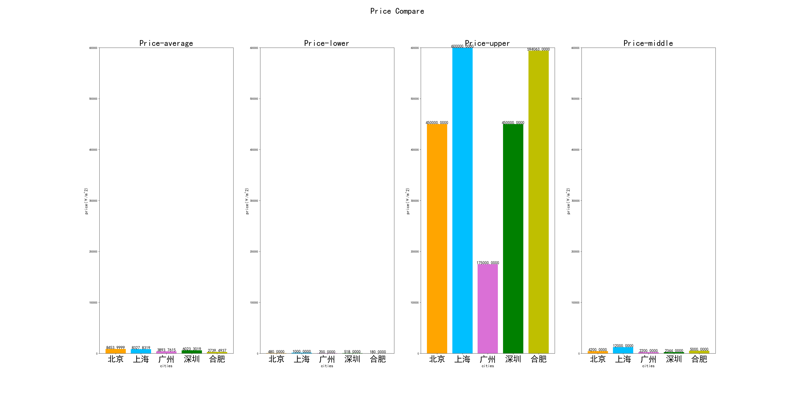

​	单位面积价格：

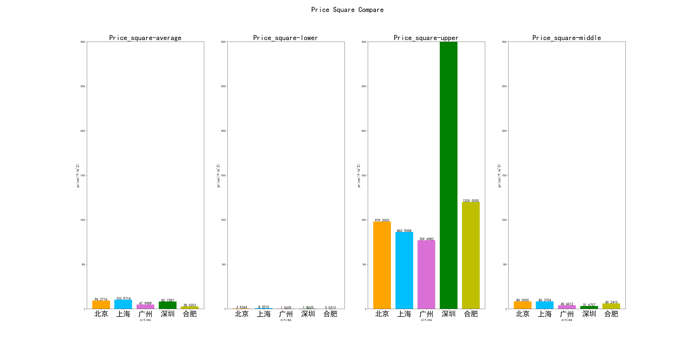

​	主要比较北京上海：

1. 北京平均价格偏高但中位数价格低很多：上海住房价格较为集中，北京有更多高房价租房。
2. 单位面积上海比北京高，上海住房面积小。


## Q2：比较 5 个城市一居、二居、三居的情况

​	各个占比：

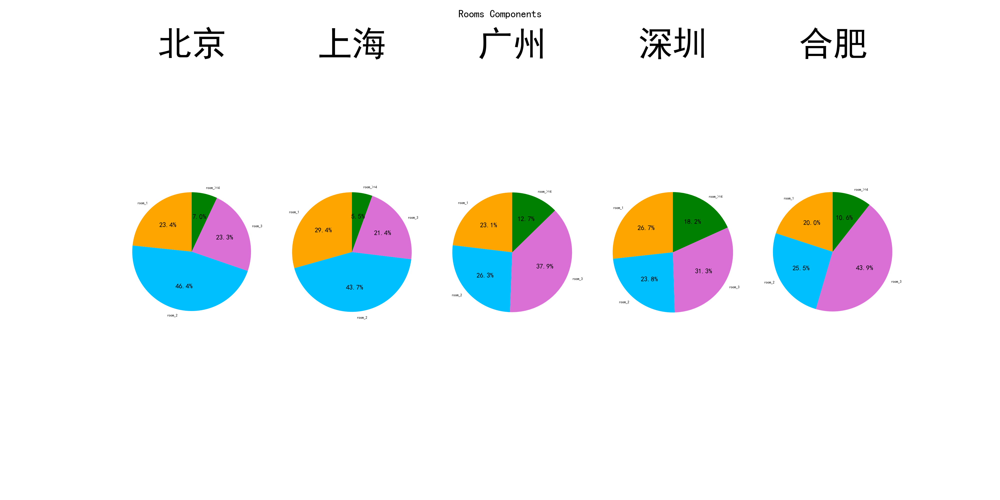

​	一室价格：

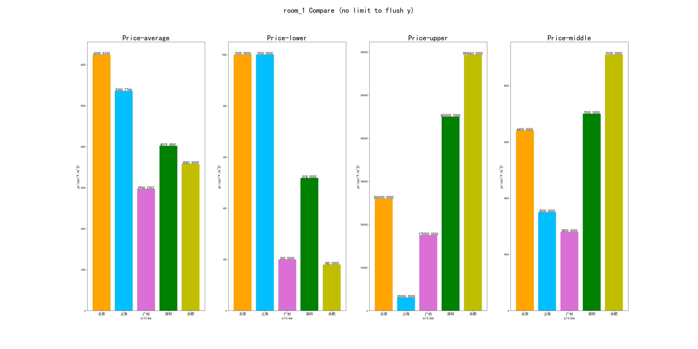

​	二室价格：

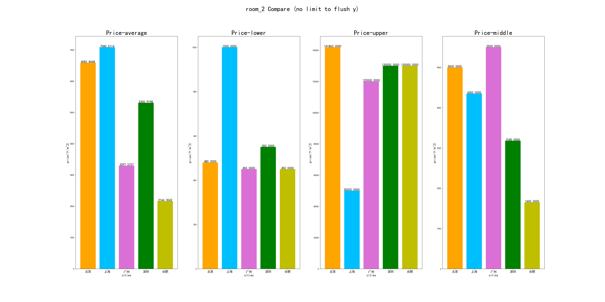

​	三室价格：


1. 北京一室很贵，上海二室三室很贵
2. 合肥一室很贵，广州二室三室很贵，深圳比他俩都高但比上海北京低。


## Q3：计算和分析每个城市不同板块的均价情况

​	ATTENTION：由于板块数量巨多，我们只选取前 **10%** 展示

​	北京：

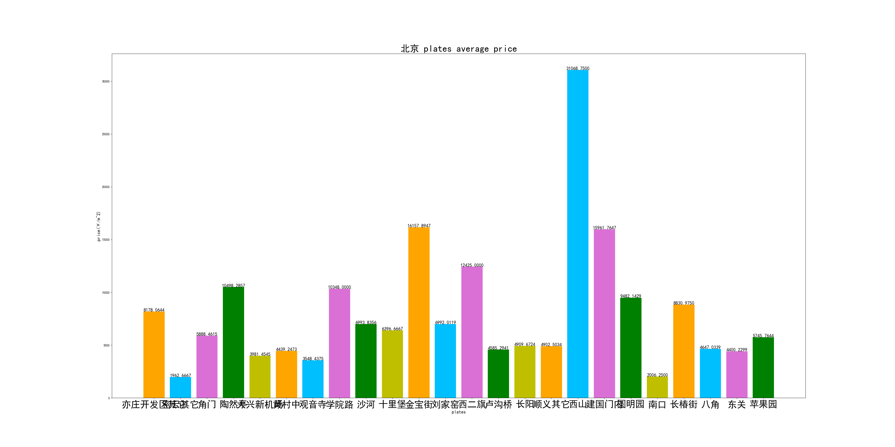

​	上海：

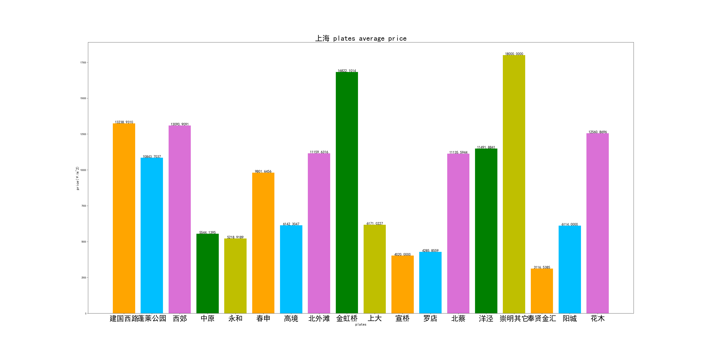

​	广州：

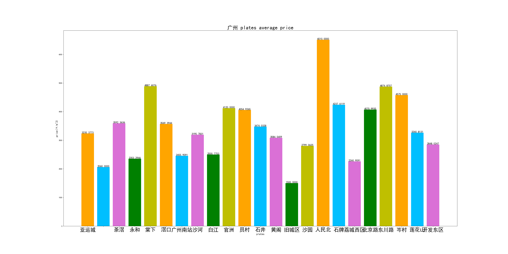

​	深圳：

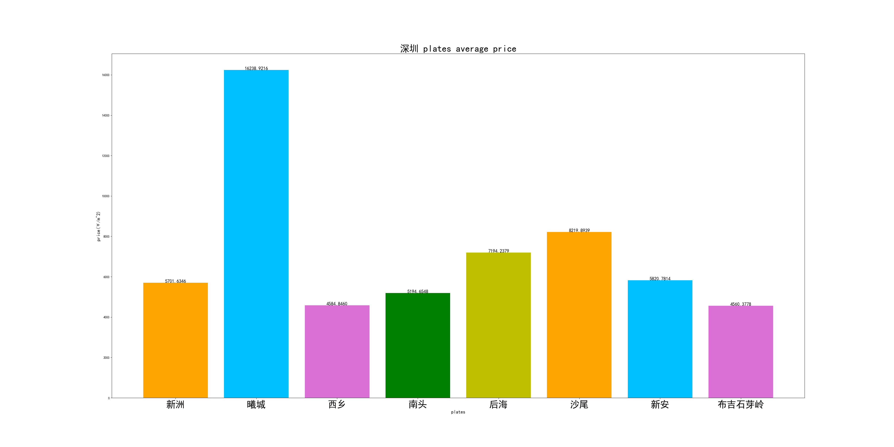

​	合肥：

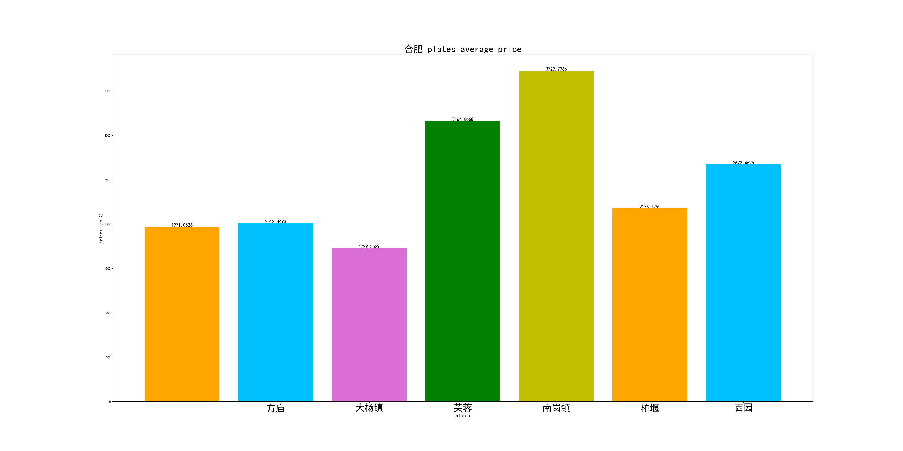


## Q4：比较各个城市不同朝向的单位面积租金分布情况

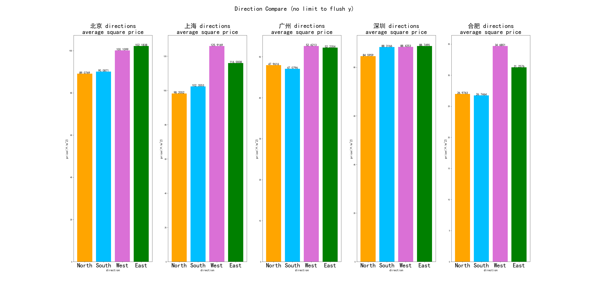

1. 各个城市不一致，比如深圳居然西边价格明显贵一点。
2. 东西朝向的房屋价格普遍比南北朝向贵（一个小前提）。
3. 沿海城市更看重南北朝向。
4. 大体上还是东南贵一点。


## Q5： GDP & 单位面积租金分布

 ATTENTION：我们引入变量：20平方米一年所支付的租金占总金额数值的比例

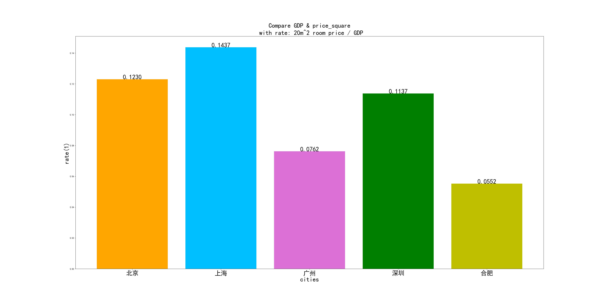

​	可以看到上海最贵，北京和深圳差不多，合肥最低。


## Q6： 平均工资 & 单位面积租金分布

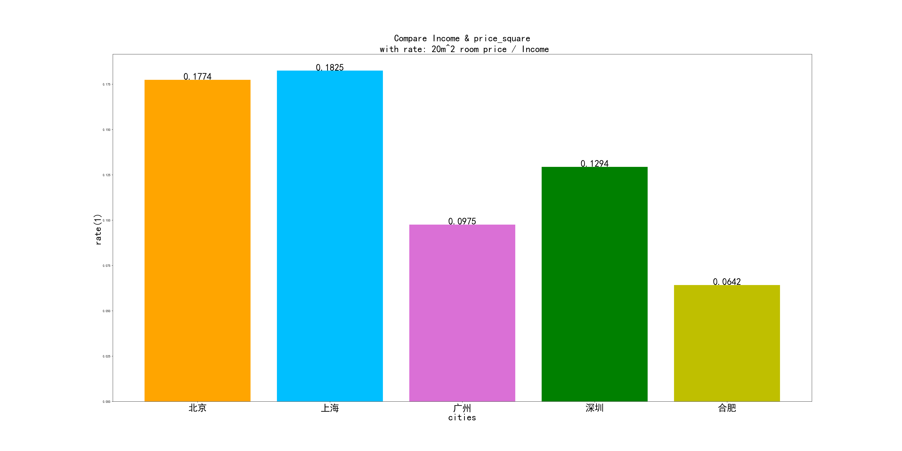

​	平均工资更能反映：北京上海差不多，其余三个明显低于上海北京，依旧合肥最低。


## Q7： 拓展 - 可支配收入 & 单位面积租金分布

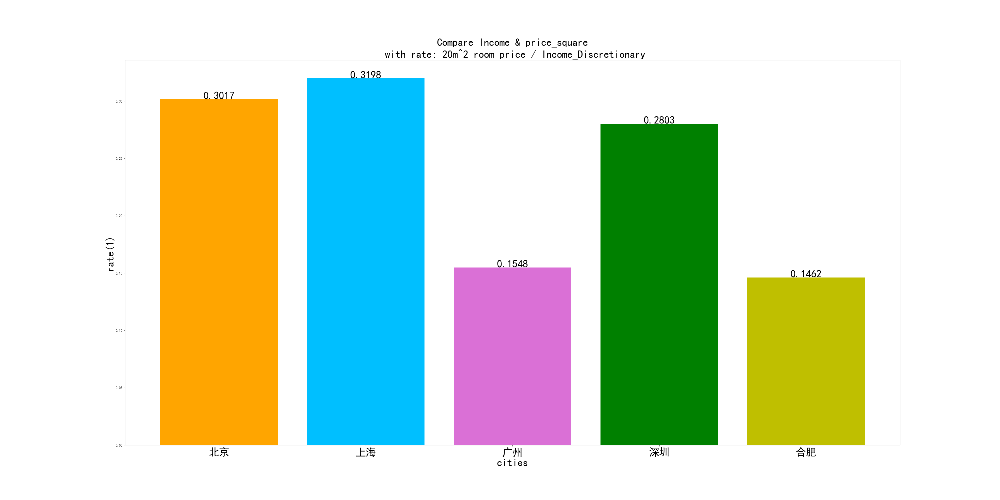

​	这里就看出来问题了：广州降到了合肥的水准！说明在可支配收入中房租占比广州很小，说明房租压力不是很大。


## Q8： 拓展 - 租房人口比例 & 常住非户籍人口比例

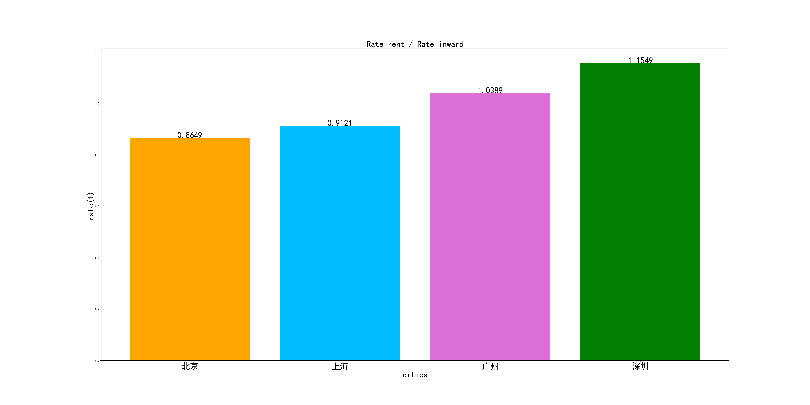

​	这是更有意思的一组数据。我们的租房人口占非户籍人口的比重，北京上海广州深圳依次增高，而北京上海小于1。这说明了入籍的难易程度：北京住了也难入籍，深圳你甚至租房也是本地户籍。所以可以看出深圳的招揽人才在户籍方面下了大功夫，而北京上海则对户籍严把关。


# 4. 遇到的问题 & 改进

1. 爬取数据：用板块方式取出的数据更可靠（综合排序页面爬取去重去脏数据后32000剩3000，地区爬取剩16000）

2. 取出换行和空格：数据要注意规整，尤其是像下图出现的数据缺省或非法。

	

3. price的处理：记录最高和最低。有 **-** 则最低最高各一个，没有则都赋值该值。

4. 脏数据：

	

	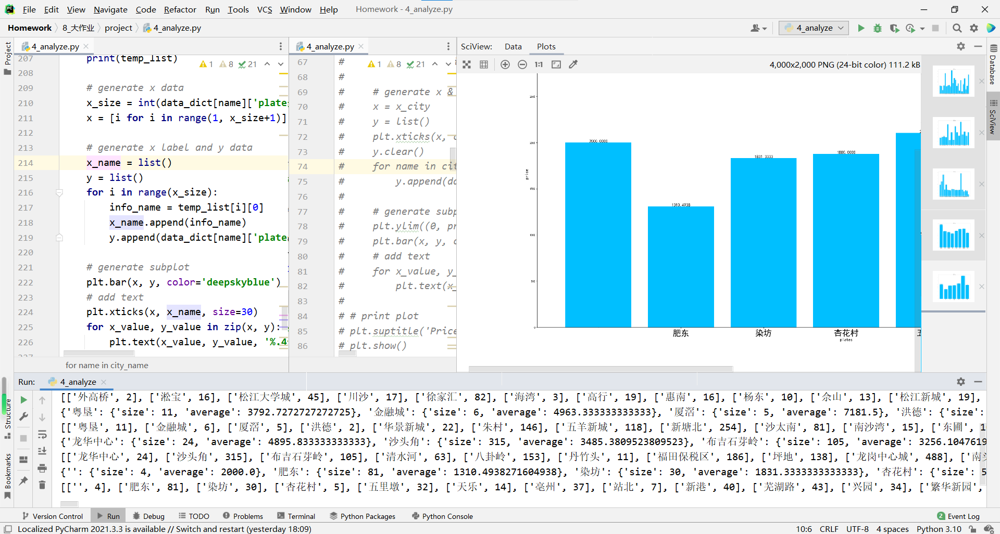
